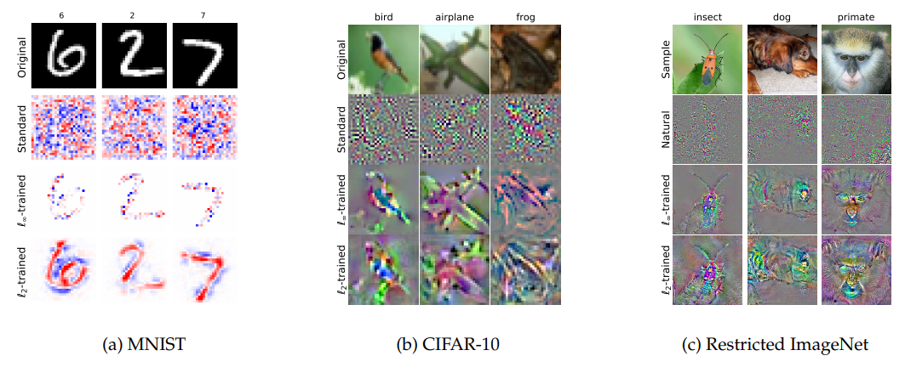

# Trying to achieve PAG (perception-aligned gradients) with adversarial training

*Image source: 1805.12152. PAG visualization and comparison with gradients of a model trained regular way.*

Models with perception-aligned gradients are benifical in several obvious ways:
1. Interpretability. One can use gradients w.r.t. input data to produce model perception (or feature importance) heatmaps
2. Robustness. To achieve PAG one would usually perform adversarial training, which makes models much more robust

## Purpose of this repository
The main reason is developing a methodology of achieving PAG for one of my pet-projects.

PAG was introduced some years ago, though I haven't found any decent implementations and decided to implement it myself. I've chosen simple problem, dataset and model architecture so it'll be easier and quicker to perform all the experiments. 

## Dataset
I've chosen MNIST, which you can acquire at https://huggingface.co/datasets/ylecun/mnist

## Results

### Ordinarily trained model (no PAG)

||||
|:---:|:---:|:---:|
||||

### Adversarially trained model (PAG)

||||
|:---:|:---:|:---:|
||||

## References
1. Madry, Aleksander, et al. "Towards deep learning models resistant to adversarial attacks." arXiv preprint arXiv:1706.06083 (2017).
2. Tsipras, Dimitris, et al. "Robustness may be at odds with accuracy." arXiv preprint arXiv:1805.12152 (2018).